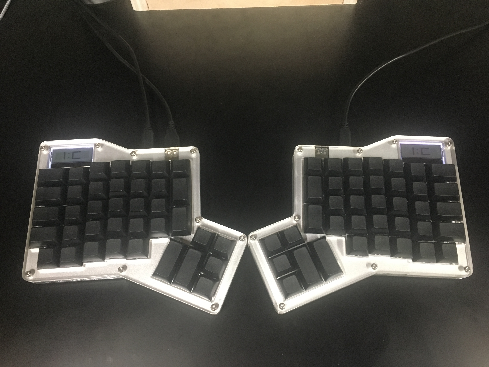
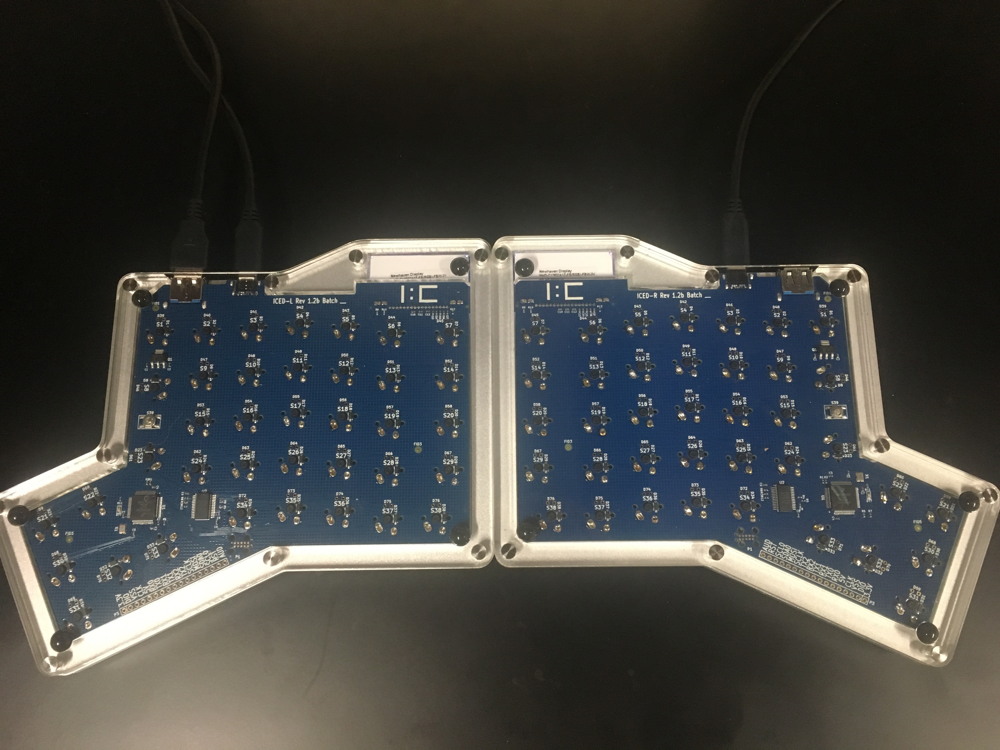

# ergodox

## The Build

I built my own keyboard using the [Infinity ErgoDox Keyboard Kit](https://www.massdrop.com/buy/18233) with [Cherry MX Brown](http://www.keyboardco.com/blog/index.php/2012/12/an-introduction-to-cherry-mx-mechanical-switches/) switches.

I did the soldering with a Hakko FX-888D based on recommendation from [this EEVBlog video](https://www.youtube.com/watch?v=J5Sb21qbpEQ)

The build went smoothly aside from some easily corrected mistakes.  I build the right side first where I forgot to remove some the protective film from the LCD.  I also used too little solder on the joints on the right side.  The surface tension of the solder allowed it to completely span even the larger through holes beneath the switches.  Both of those problems are now fixed.  I also left out the smaller white plastic pieces of the stabilizers.  The [build guide](https://input.club/devices/infinity-ergodox/infinity-ergodox-build-guide/) I was following didn't do a great job of showing this.  I later found [this build](http://www.burritoware.me/proj/infinity-ergodox/) that made it clear how to install the stabilizers.

Nothing can hide behind the clear acryllic case.  My build has a single dog hair and a fleck of cardboard that haunt my dreams.  At some point I might make a custom hard wood case for this.

## Configuration

I've done some light remapping using the [Input Club Configurator](https://input.club/configurator-ergodox/). I plan on doing substantial remapping, version controlled, of course.
